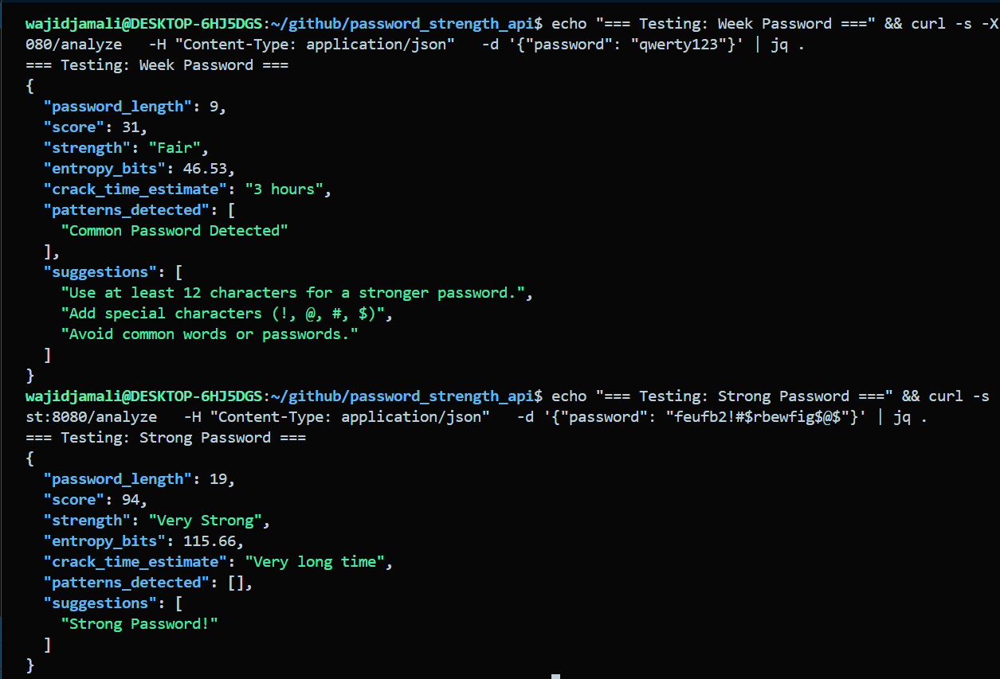

# 🔐 Password Strength Analyzer API

A fast, offline REST API built in **Rust** (Actix-Web) that analyzes password strength using entropy calculation, common pattern detection, and actionable suggestions.

---

## Demo



## Features

- **Entropy calculation** — bits of entropy based on character pool & length
- **Crack time estimate** — how long a GPU-based offline attack would take
- **Pattern detection** — common passwords, keyboard walks, leet-speak, date patterns, repeated/sequential characters
- **Strength score** — 0–100 score with label (Weak / Fair / Strong / Very Strong)
- **Suggestions** — specific tips to improve the password
- **Character pool analysis** — breakdown of character classes used

---

## API Endpoints

### `POST /analyze`

Analyze a password.

**Request**
```json
{
  "password": "P@ssw0rd123!"
}
```

**Response**
```json
{
  "password_length": 12,
  "score": 72,
  "strength": "Strong",
  "entropy_bits": 78.84,
  "crack_time_estimate": "3 months",
  "character_pool": {
    "has_lowercase": true,
    "has_uppercase": true,
    "has_digits": true,
    "has_symbols": true,
    "pool_size": 94
  },
  "patterns_detected": [
    "Leet-speak substitution of a common password"
  ],
  "suggestions": [
    "Avoid common words or passwords."
  ]
}
```

---

### `GET /health`

```json
{ "status": "ok", "service": "Password Strength Analyzer API" }
```

---

## Getting Started

### Prerequisites
- [Rust](https://rustup.rs/)

### Run locally

```bash
git clone https://github.com/abwajidjamali/password-strength-analyzer
cd password-strength-analyzer
cargo run
```

Server starts at `http://127.0.0.1:8080`

### Test with curl

```bash
# Health check
curl http://localhost:8080/health

# Analyze a password
curl -X POST http://localhost:8080/analyze \
  -H "Content-Type: application/json" \
  -d '{"password": "MyS3cur3P@ss!"}'
```

---

## Tech Stack

| Tool | Purpose |
|------|---------|
| [Rust](https://www.rust-lang.org/) | Language |
| [Actix-Web 4](https://actix.rs/) | HTTP framework |
| [Serde](https://serde.rs/) | JSON serialization |
| [Regex](https://docs.rs/regex) | Pattern matching |
| [Tokio](https://tokio.rs/) | Async runtime |

---
